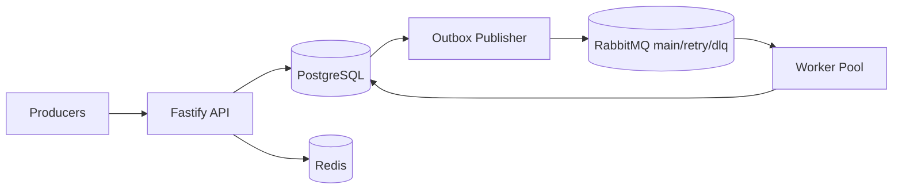

# StreamForge

StreamForge es un ingestion gateway para eventos de negocio.
Lo pones delante de productores (POS, integraciones, webhooks) cuando necesitas recibir eventos una vez, publicarlos al broker y procesarlos con reintentos, DLQ y replay sin perder trazabilidad.

## Quickstart (Docker)

```bash
cp .env.example .env
docker compose up --build -d
curl -s http://localhost:3000/ready
```

Escalar workers:

```bash
docker compose up --build -d --scale worker=3
```

## Demo En 60s

1. Enviar 1 evento:

```bash
curl -s -X POST http://localhost:3000/v1/events \
  -H "Content-Type: application/json" \
  -H "X-Tenant-Id: tenant-demo" \
  -H "X-Correlation-Id: corr-demo-1" \
  -d '{
    "eventId":"demo-sale-1",
    "eventType":"SALE",
    "subject":"order-1001",
    "occurredAt":"2026-02-22T12:00:00.000Z",
    "payload":{"amount":120.5,"currency":"USD"},
    "source":"readme-demo",
    "schemaVersion":"1.0.0",
    "specVersion":"1.0"
  }'
```

```bash
curl -s http://localhost:3000/v1/events/demo-sale-1
```

2. Enviar stream NDJSON:

```bash
cat <<'EOF' | curl -s -X POST http://localhost:3000/v1/ingest/stream \
  -H "Content-Type: application/x-ndjson" \
  -H "X-Tenant-Id: tenant-demo" \
  --data-binary @-
{"eventId":"demo-stream-1","eventType":"SALE","subject":"order-2001","occurredAt":"2026-02-22T12:00:01.000Z","payload":{"amount":10,"currency":"USD"},"source":"readme-demo"}
{"eventId":"demo-stream-2","eventType":"PAYMENT","subject":"order-2001","occurredAt":"2026-02-22T12:00:02.000Z","payload":{"amount":10,"currency":"USD"},"source":"readme-demo"}
{"eventId":"demo-stream-3","eventType":"SALE","subject":"order-2002","occurredAt":"2026-02-22T12:00:03.000Z","payload":{"amount":22,"currency":"USD"},"source":"readme-demo"}
EOF
```

3. Ver metricas:

```bash
curl -s http://localhost:3000/metrics | grep -E "streamforge_ingest_total|streamforge_outbox_backlog|streamforge_worker_dlq_total"
```

4. Forzar DLQ y hacer replay:

```bash
curl -s -X POST http://localhost:3000/v1/events \
  -H "Content-Type: application/json" \
  -H "X-Tenant-Id: tenant-demo" \
  -d '{
    "eventId":"demo-bad-1",
    "eventType":"UNKNOWN_TYPE",
    "subject":"order-bad-1",
    "occurredAt":"2026-02-22T12:00:04.000Z",
    "payload":{"amount":"not-number"},
    "source":"readme-demo"
  }'
curl -s http://localhost:3000/v1/events/demo-bad-1
```

```bash
ADMIN_TOKEN="streamforge-admin-change-me"
curl -s "http://localhost:3000/v1/admin/dlq/reasons?tenantId=tenant-demo&limit=10" \
  -H "X-Admin-Token: ${ADMIN_TOKEN}"
curl -s -X POST http://localhost:3000/v1/admin/dlq/retry \
  -H "Content-Type: application/json" \
  -H "X-Admin-Token: ${ADMIN_TOKEN}" \
  -d '{"tenantId":"tenant-demo","limit":10}'
curl -s -X POST http://localhost:3000/v1/admin/replay \
  -H "Content-Type: application/json" \
  -H "X-Admin-Token: ${ADMIN_TOKEN}" \
  -d '{"tenantId":"tenant-demo","status":"DLQ","mode":"reprocess","limit":50}'
```

## Architecture Diagram



## Reliability Model

Outbox states: `PENDING -> IN_FLIGHT -> PUBLISHED/FAILED`, with lease recovery via `OUTBOX_INFLIGHT_LEASE_SECONDS`.

Delivery semantics:
- Ingest acceptance: accepted once, stored durably.
- Publish: at-least-once.
- Worker effects: idempotent effects, at-least-once.
- Replay: safe replay; dedupe and worker idempotency prevent double business effects.

What happens when...
- Redis cae: dedupe rapido se degrada; PostgreSQL sigue siendo barrera fuerte.
- PostgreSQL cae: ingest no confirma (`500`); no se pierde evento "aceptado" porque nunca se acepta sin commit.
- RabbitMQ cae: API puede seguir aceptando; outbox backlog crece hasta recuperar broker.
- Publisher cae en medio de lote: filas `IN_FLIGHT` se reclaman por lease timeout.
- Worker reinicia en medio: RabbitMQ reentrega mensajes no `ack`; efecto sigue idempotente.
- Llega el mismo evento 20 veces: Redis o Postgres detectan duplicado (`409 duplicate`).
- Error retryable en worker: va a `events.retry` con backoff hasta `MAX_RETRY_ATTEMPTS`.
- Error no retryable: va directo a `events.dlq`.
- Stream supera `STREAM_MAX_BYTES`: request falla sin tumbar proceso.
- Evento supera `MAX_EVENT_BYTES`: API responde `413`.

Why these choices:
- Redis + Postgres para dedupe: Redis baja latencia; Postgres garantiza consistencia.
- Outbox en vez de publish directo: evita perder eventos entre commit DB y broker publish.
- Retry queues en vez de requeue infinito: controlas backoff, poison messages y saturacion.
- NDJSON streaming + backpressure nativo: alto throughput con memoria acotada.

Docs tecnicos extendidos: `docs/architecture.md`, `docs/sequences.md`, `docs/failure-modes.md`.

## Event Contract

Input envelope:
- `eventType` (preferido) o `type` (legacy).
- `subject` (preferido) o `entityId` (legacy).
- `occurredAt`, `payload`, `source`, `schemaVersion`, `specVersion`.
- `partitionKey` opcional (default: `subject`).

Normalizado internamente:
- `eventId`, `tenantId`, `type`, `subject`, `partitionKey`.
- `occurredAt`, `payload`, `hash`, `correlationId`.

## Admin Operations (Replay / DLQ)

- `POST /v1/admin/replay`: replay por filtros (`tenantId`, rango, `type`, `status`, `mode`).
- `GET /v1/admin/dlq/reasons`: top motivos de DLQ.
- `POST /v1/admin/dlq/retry`: reencola eventos en `DLQ`.
- Requiere header `X-Admin-Token`.

## Observability

- Health/readiness: `GET /health`, `GET /ready`.
- Prometheus: `GET /metrics`.
- Metricas clave: `streamforge_ingest_total`, `streamforge_outbox_backlog`, `streamforge_worker_retry_total`, `streamforge_worker_dlq_total`, `streamforge_dlq_size`.

## Benchmarks (Snapshot + Context)

Fuente: `reports/load-events-example.json` y `reports/load-stream-example.json`.

Contexto de corrida:
- Host: laptop local (Windows + Docker Desktop).
- CPU: `<completar al repetir benchmark>`.
- RAM: `<completar al repetir benchmark>`.
- Node.js: 22.x.
- Docker: `docker compose` default, 1 worker.
- Payload promedio: ~230-240 bytes/evento.
- Dedupe strategy: `DEDUPE_STRATEGY=intent`.

| Scenario | Concurrency | Duration | Avg Req/s | p50(ms) | p90(ms) | p99(ms) |
|---|---:|---:|---:|---:|---:|---:|
| `POST /v1/events` | 100 | 30s | 158.7 | 39 | 61 | 97 |
| `POST /v1/ingest/stream` | 20 | 20s | 24.5 | 121 | 188 | 329 |

Estos numeros son de una corrida local de referencia; tus resultados variaran segun hardware y configuracion.

## Production Readiness Checklist

- [x] Durable ingest en PostgreSQL.
- [x] Dedupe en dos capas (Redis + Postgres).
- [x] Outbox con lease recovery para crash safety.
- [x] Retry + DLQ + replay administrativo.
- [x] Metricas Prometheus y correlation IDs.
- [x] Load tests reproducibles (`npm run load:events`, `npm run load:stream`).
- [x] CI con tests unitarios + integracion con servicios reales.

## Repository Structure

```text
apps/
  api/
  publisher/
  worker/
packages/
  shared/
migrations/
scripts/
reports/
docs/
.github/workflows/
```

## License

MIT. See `LICENSE`.
