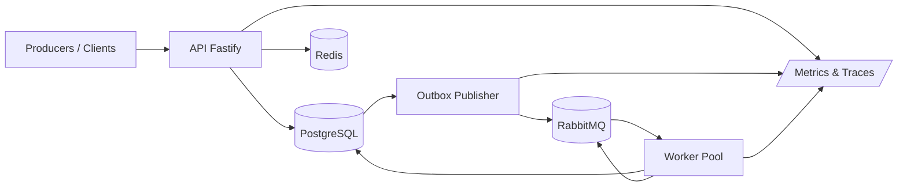
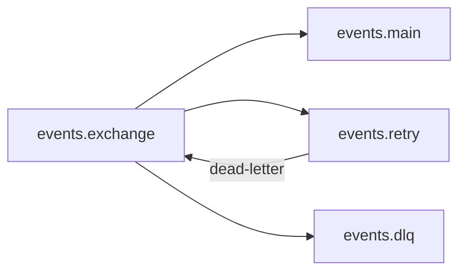

# Architecture

## Component Model

## Queue Topology

## Data Ownership

- PostgreSQL is the source of truth for `events`, idempotency keys, outbox, and processing attempts.
- Redis is an acceleration layer for hot dedupe and tenant rate limiting.
- RabbitMQ is the transport layer, not the persistence layer.

## Ordering Model

- Global ordering is not guaranteed.
- `partitionKey` is carried in message headers and payload to allow per-entity ordering strategies.
