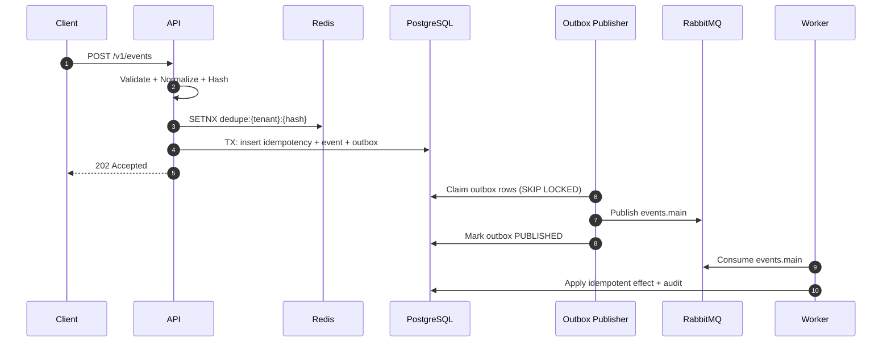
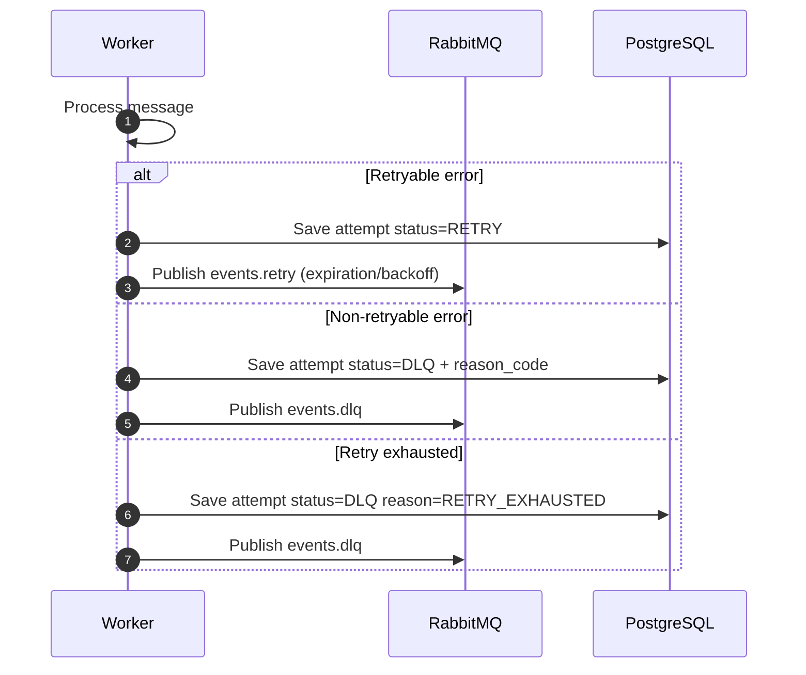
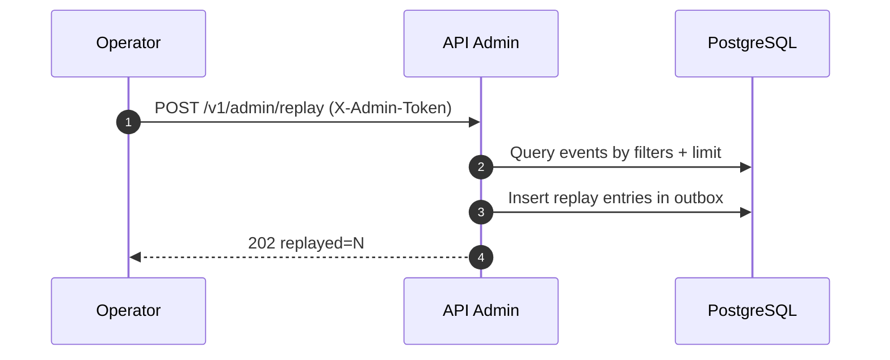

# Sequence Flows

## Single Event Ingestion (`POST /v1/events`)

```mermaid
sequenceDiagram
  autonumber
  participant C as Client
  participant A as API
  participant R as Redis
  participant P as PostgreSQL
  participant O as Outbox Publisher
  participant Q as RabbitMQ
  participant W as Worker

  C->>A: POST /v1/events
  A->>A: Validate + Normalize + Hash
  A->>R: SETNX dedupe:{tenant}:{hash}
  A->>P: TX: insert idempotency + event + outbox
  A-->>C: 202 Accepted
  O->>P: Claim outbox rows (SKIP LOCKED)
  O->>Q: Publish events.main
  O->>P: Mark outbox PUBLISHED
  W->>Q: Consume events.main
  W->>P: Apply idempotent effect + audit
```

## Retry and DLQ Path

```mermaid
sequenceDiagram
  autonumber
  participant W as Worker
  participant Q as RabbitMQ
  participant P as PostgreSQL

  W->>W: Process message
  alt Retryable error
    W->>P: Save attempt status=RETRY
    W->>Q: Publish events.retry (expiration/backoff)
  else Non-retryable error
    W->>P: Save attempt status=DLQ + reason_code
    W->>Q: Publish events.dlq
  else Retry exhausted
    W->>P: Save attempt status=DLQ reason=RETRY_EXHAUSTED
    W->>Q: Publish events.dlq
  end
```

## Admin Replay

```mermaid
sequenceDiagram
  autonumber
  participant Ops as Operator
  participant API as API Admin
  participant P as PostgreSQL

  Ops->>API: POST /v1/admin/replay (X-Admin-Token)
  API->>P: Query events by filters + limit
  API->>P: Insert replay entries in outbox
  API-->>Ops: 202 replayed=N
```
